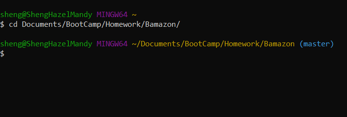
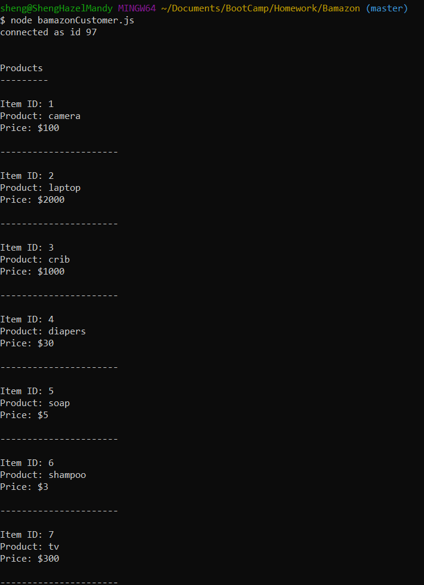
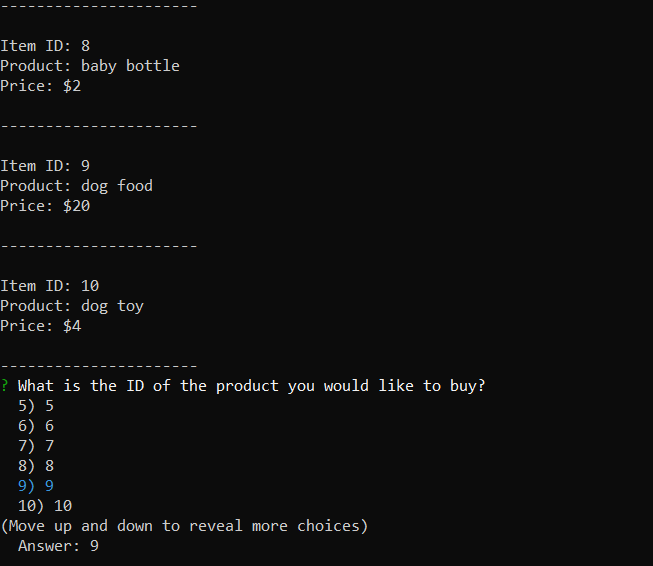
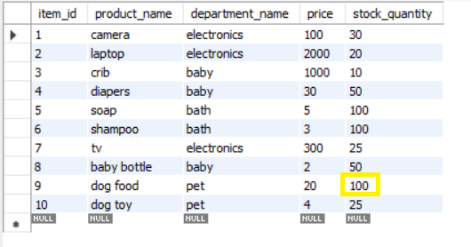

# Bamazon

`Bamazon` is an Amazon-like storefront using Node.js and MySQL. The customer node app takes in orders from customers and depletes stock from the store's inventory. The manager node app allows the manager to keep track of the inventory, add stock to the inventory, and add new products to the inventory.

## Purpose

To use Node.js and MySQL to create command line Node apps that use the MySQL and Inquirer modules.

## Goals

- Create a CLI Node app using MySQL and Node.js
- Use for loops
- Use if/else statements
- Use functions
- Use MySQL database
- Use package MySQL
- Use package Inquirer

## Technologies Used 

* Git Bash
* GitHub
* MySQL
* Node.js
* Node packages: 
    * MySQL
    * Inquirer 

## Instructions

Open up the terminal or Git Bash window and navigate to the folder/directory for `Bamazon` where the files `bamazonCustomer.js` and `bamazonManager.js` are stored. 



Type the command below to open the Customer Node application, which starts up by showing the list of products currently available.

```node bamazonCustomer.js```



After the list is displayed, a prompt asks for the ID of the product you would like to purchase. 



We see the MySQL database table with no changes made yet. But we are about to choose ID 9 and make a change to the stock quantityby making a purchase. 




## License

MIT License

Copyright (c) [2020] [Hazel N. Reyes]

Permission is hereby granted, free of charge, to any person obtaining a copy
of this software and associated documentation files (the "Software"), to deal
in the Software without restriction, including without limitation the rights
to use, copy, modify, merge, publish, distribute, sublicense, and/or sell
copies of the Software, and to permit persons to whom the Software is
furnished to do so, subject to the following conditions:

The above copyright notice and this permission notice shall be included in all
copies or substantial portions of the Software.

THE SOFTWARE IS PROVIDED "AS IS", WITHOUT WARRANTY OF ANY KIND, EXPRESS OR
IMPLIED, INCLUDING BUT NOT LIMITED TO THE WARRANTIES OF MERCHANTABILITY,
FITNESS FOR A PARTICULAR PURPOSE AND NONINFRINGEMENT. IN NO EVENT SHALL THE
AUTHORS OR COPYRIGHT HOLDERS BE LIABLE FOR ANY CLAIM, DAMAGES OR OTHER
LIABILITY, WHETHER IN AN ACTION OF CONTRACT, TORT OR OTHERWISE, ARISING FROM,
OUT OF OR IN CONNECTION WITH THE SOFTWARE OR THE USE OR OTHER DEALINGS IN THE
SOFTWARE.
