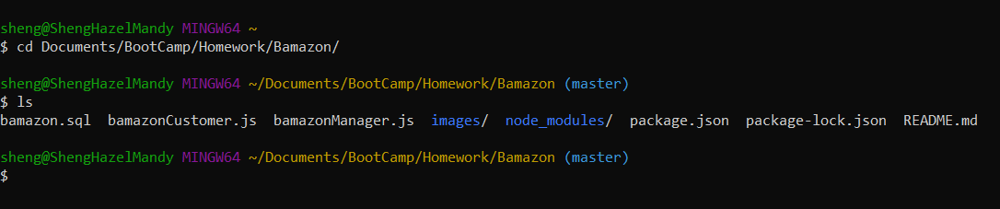
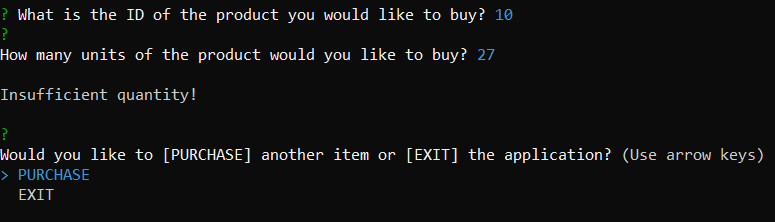

# Bamazon

`Bamazon` is an Amazon-like storefront using Node.js and MySQL. The customer node app takes in orders from customers and depletes stock from the store's inventory. The manager node app allows the manager to keep track of the inventory, add stock to the inventory, and add new products to the inventory.

## Purpose

To use Node.js and MySQL to create command line Node apps that use the MySQL and Inquirer modules.

## Goals

- Create a CLI Node app using MySQL and Node.js
- Use for loops
- Use if/else statements
- Use functions
- Use MySQL database
- Use package MySQL
- Use package Inquirer

## Technologies Used 

* Git Bash
* GitHub
* MySQL
* Node.js
* Node packages: 
    * MySQL
    * Inquirer 

## Instructions

Open up the terminal or Git Bash window and navigate to the folder/directory for `Bamazon` where the files `bamazonCustomer.js` and `bamazonManager.js` are stored. 



Type the command below to open the Customer Node application, which starts up by showing the list of products currently available.

```node bamazonCustomer.js```


After the list is displayed, a prompt asks for the ID of the product you would like to purchase. 


The MySQL database table show no changes made yet. ID 9 is going to be chosen and the stock quantity will be changed by making a purchase. 


After product ID 9 is chosen, a prompt then asks how many units of the product you would like to purchase. 5 is inputted and the total cost of the purchase is displayed. Another prompt asks if you want to purchase another item or exit the application.


The database table is updated and now shows 5 units less in stock quantity for Product ID 9 after purchasing 5 units of the product.


After choosing "Purchase", the list of products is displayed.


The prompt asking for the ID of the desired product appears.


The database table shows 50 units in stock quantity for Product ID 4.


5 units of product ID 4 is inputted and the total cost is displayed. The prompt to purchase again or exit is displayed. "Exit" is chosen and the application ends.


The database table updates and now shows 5 units less of the product ID 4.


We are now going to try to purchase more than what is in stock for product ID 10.


27 units of the product is inputted and we are told "Insufficient Quantity!". Then, the prompt to purchase or exit then appears.



Type the command below to open the Manager Node application, which starts up by showing the menu of options to choose from.

```node bamazonManager.js```


After choosing "View Products for Sale", a list of all products with stock quantity appears.


A prompt then appears, asking to choose another option or if you are done with the app.


Let's say there are 100 units of soap in stock.


Then, let's say the customer bought 96 units of soap.


Now, there are only 4 units of soap in stock.


Now, the manager (on the Manager Node app) wants to select "View Low Inventory", which will show all the products that are less than 5 units in stock.


"View Low Inventory" is selected, and the app displays the products that are low in inventory. Then, we are prompted to choose another option or if we are done.


Now, the manager wants to add to the inventory by selecting "Add to Inventory".


"Add to Inventory" is selected, and a list of product names appear for the manager to choose from.

.PNG)

Soap is selected, 50 units are inputted, and an alert appears that 50 units have been added to the soap inventory.


"Choose" is selected, then "View Products for Sale" is chosen, and it is shown that there are currently 54 units of soap now.


Now, the manager wants to add a product by selecting "Add New Product".


"Add New Product" is chosen. Then several prompts appear for the manager to input information about the new product. The app alerts us that 1 product is added to the inventory. Then, "Done" is chosen and the application ends.


Now, the manager wants to view the products currently for sale.


The new product is given product ID 11 and is displayed as one of the products for sale.


## License

MIT License

Copyright (c) [2020] [Hazel N. Reyes]

Permission is hereby granted, free of charge, to any person obtaining a copy
of this software and associated documentation files (the "Software"), to deal
in the Software without restriction, including without limitation the rights
to use, copy, modify, merge, publish, distribute, sublicense, and/or sell
copies of the Software, and to permit persons to whom the Software is
furnished to do so, subject to the following conditions:

The above copyright notice and this permission notice shall be included in all
copies or substantial portions of the Software.

THE SOFTWARE IS PROVIDED "AS IS", WITHOUT WARRANTY OF ANY KIND, EXPRESS OR
IMPLIED, INCLUDING BUT NOT LIMITED TO THE WARRANTIES OF MERCHANTABILITY,
FITNESS FOR A PARTICULAR PURPOSE AND NONINFRINGEMENT. IN NO EVENT SHALL THE
AUTHORS OR COPYRIGHT HOLDERS BE LIABLE FOR ANY CLAIM, DAMAGES OR OTHER
LIABILITY, WHETHER IN AN ACTION OF CONTRACT, TORT OR OTHERWISE, ARISING FROM,
OUT OF OR IN CONNECTION WITH THE SOFTWARE OR THE USE OR OTHER DEALINGS IN THE
SOFTWARE.
